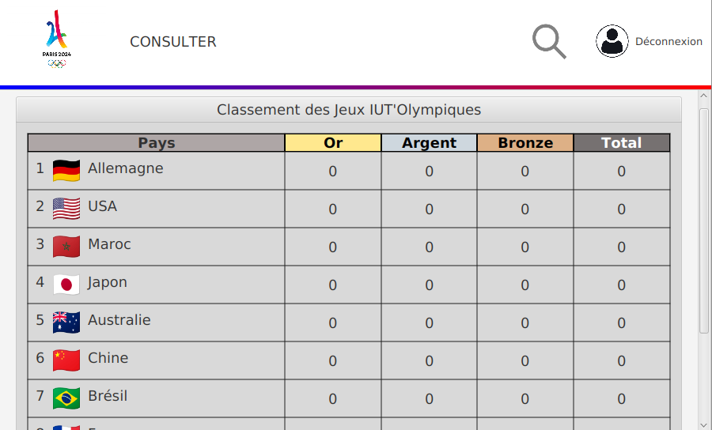

# Manuel Utilisateur - Page de Connexion et Inscription (JavaFX)

## Introduction
Ce manuel utilisateur vous guidera à travers les étapes de connexion et d'inscription à l'application des Jeux IUT'Olympiques, développée en JavaFX. Les interfaces sont conçues pour être intuitives et faciles à utiliser, vous permettant de vous connecter ou de créer un compte rapidement.


## Installation

### Prérequis

- **Java** : Assurez-vous d'avoir Java installé sur votre ordinateur. Vous pouvez télécharger la dernière version de Java sur le site officiel d'Oracle : [Télécharger Java](https://www.oracle.com/java/technologies/javase-jdk11-downloads.html).

- **JavaFX** : Assurez-vous d'avoir JavaFX installé sur votre ordinateur. Vous pouvez télécharger JavaFX sur le site officiel d'OpenJFX : [Télécharger JavaFX](https://openjfx.io/).

- **Base de Données** : Vous devez lancer sur votre terminal mysql et créer la base de données avec le fichier
db_jo.sql qui se trouve a la racine du projet.

   ```
    mysql -u root -p 
    source db_jo.sql
    ```

### Téléchargement

1. **Cloner le Dépôt** :
    - Ouvrez un terminal et exécutez la commande suivante pour cloner le dépôt GitHub :
        ```bash
        git clone `le lien du depot github`
        ```

2. Vous devez être soit connecté au portail de connexion de l'**IUT** soit connecté à **Internet** au préalable pour pouvoir vous connecter à l'application. Cela est nécessaire pour que l'application puisse accéder à la base de données des **drapeaux** des pays qui sont sur un site internet.


### Lancement de l'Application


1. **Exécution de l'Application** :
    - Vous trouverez dans le répertoire du projet un fichier **"JeuxIUTOlympiques.desktop"**.
    - Double-cliquez sur le fichier pour lancer l'application des Jeux IUT'Olympiques.


## Aperçu des Interfaces

### Interface d'Accueil


### Interface de Connexion // Mettre photo


### Interface d'Inscription


## Instructions d'Utilisation

### Accès à la Page de Connexion

### NB : Pour accéder à l'application en tant qu'administrateur, vous devez vous connecter avec les identifiants suivants : **admin / admin**

1. **Ouvrir l'Application** :
   - Lancez l'application des Jeux IUT'Olympiques avec les instructions fournies dans la section précédente.

2. **Interface d'Accueil** :
    - Vous arriverez sur l'interface d'accueil avec le logo "IUT 2024" et deux boutons : "Se connecter" et "S'inscrire".
    - Cliquez sur "Se connecter" pour accéder à la page de connexion.

### Connexion à l'Application (Seulement les Utilisateurs Déjà Inscrits Sinon Voir **Inscription**)

1. **Champs de Connexion** :
    - Sur la page de connexion, vous trouverez deux champs de saisie :
        - **Pseudo** : Entrez votre nom d'utilisateur ou votre pseudonyme.
        - **Mot de passe** : Entrez votre mot de passe. Vous pouvez cliquer sur l'icône de l'œil pour afficher/masquer le mot de passe.

2. **Bouton de Connexion** :
    - Après avoir rempli les champs requis, cliquez sur le bouton bleu "Connexion" pour vous connecter à l'application.

### Inscription à l'Application

1. **Accès à la Page d'Inscription** :
    - Si vous n'avez pas encore de compte, cliquez sur le bouton "S'inscrire" soit sur la page d'accueil, soit sur la page de connexion.

2. **Formulaire d'Inscription** :

    - Remplissez les informations demandées (comme le pseudonyme, le mot de passe, etc.). Suivez les instructions à l'écran pour compléter votre inscription.


3. **Bouton d'Inscription** :
    - Après avoir rempli le formulaire, cliquez sur le bouton "S'inscrire" pour créer votre compte.

    - Vous pouvez maintenant vous connecter à l'application en utilisant les informations d'identification que vous avez fournies lors de l'inscription.


### Erreurs de Connexion

1. **Gestion des Erreurs** :
    - Si vous entrez des informations incorrectes, des messages d'erreur explicites s'afficheront pour vous guider dans la correction des erreurs.

# Accueil :

Une fois connecté à l'application des **Jeux IUT'Olympiques**, vous accédez à une interface qui variera en fonction du rôle qui vous a été attribué.

### Journaliste :

Si vous êtes un **Journaliste**, vous aurez accès à des fonctionnalités **restreintes**, telles que la consultation des performances des athlètes ou d'un Pays .

### Administrateur :

Si vous êtes un **Administrateur**, vous aurez accès à des fonctionnalités avancées, telles que l'ajout de nouvelles athlètes, de nouvelles équipes ect...

### Organisateur :

Si vous êtes un **Organisateur**, vous aurez accès à la fonctionnalité de lancement des jeux. Vous et vous seul pouvez lancer les jeux. 

### Informations :

Peu importe votre rôle, vous aurez accès aux mêmes fonctionnalités que le **Journaliste**.


## Aperçu de l'Interface

### Interface Principale


# Navigation

## Accueil

Vous êtes maintenant connecté à l'application des Jeux IUT'Olympiques. Vous pouvez naviguer à travers les différentes sections en utilisant la barre de navigation en haut de l'écran.

### Actualités
Vous avez maintenant devant vous les différentes actualités récentes des Jeux IUT'Olympiques.

### Barre de Navigation

La barre de navigation vous permet d'accéder rapidement aux différentes sections de l'application. Voici un aperçu des différentes sections :

1. **Accueil** : Retour à la page d'accueil en cliquant sur le logo en haut à droite.


2. **Consulter** : Accès à la section de consultation des Médailles et des Compétitions.

    #### Interface de Consultation :


    
    
    - Devant Vous se dresse un choix entre **"Médailles"** et **"Compétition"**.

        - **Médailles** : Vous permet de consulter les médailles d'**Or**, d'**argent** et de **bronze** remportées par les **Pays**.

        #### Interface de Consultation des Médailles :

        

        - **Compétition** : Vous permet de consulter les différentes compétitions terminées avec le classement ( **1 er**  , **2 ème** ,  **3 ème** ) et le nombre de participants .

        #### Interface de Consultation des Compétitions :

        

        **ATTENTION** : Vous ne pouvez pas consulter les **Compétitions** et les **Médailles**  des Compétitions qui n'ont pas été jouées c'est à dire qu'il faut que l'organisateur lance les jeux avant que vous consultiez les résultats.

3. **(Administrateur)** **Ajouter** : Accès à la section d'ajout de nouvelles informations.

    #### Interface d'Ajout :

    

    - Vous pouvez ajouter de nouveaux **Athlètes**, de nouvelles **Equipes**

        - **Ajout d'Athlètes** : Vous permet d'ajouter un nouvel athlète à la base de données.
            - Vous devez renseigner le **Nom**, le **Prénom**, la **Date de Naissance**, le **Pays** et l' **Equipe** de l'athlète.

        - **Ajout d'Equipes** : Vous permet d'ajouter une nouvelle équipe à la base de données.
            - Vous devez renseigner le **Nom** de l'équipe et la **Compétition** de l'équipe.


4. **(Administrateur)** **Utilisateur** : Accès à la section de gestion des utilisateurs.

    #### Interface de Gestion des Utilisateurs :

    


    - Vous pouvez consulter la liste des utilisateurs inscrits et leurs rôles respectifs.
    
    - Vous pouvez également modifier le rôle d'un utilisateur en selectionnant le rôle que vous voulez lui attribuer.

        - **Modifier le Rôle** : Vous permet de changer le rôle d'un utilisateur en choisissant parmi les options suivantes : **Journaliste**, **Administrateur** ou **Organisateur**.

5. **(Organisateur)** **Lancer les Jeux** : Accès à la section de lancement des Jeux.

    #### Interface de Lancement des Jeux :

    

    - Vous pouvez lancer les jeux en cliquant sur le bouton **"Lancer les Jeux"**.

6. **Recherche** : Accès à la barre de recherche pour trouver des informations spécifiques.

    - Vous pouvez rechercher des informations par **Pays** ou **Athlètes** en tapant le terme de recherche dans la barre de recherche.


7. **Déconnexion** : Vous permet de vous déconnecter de l'application.

    - Vous pouvez vous déconnecter en cliquant sur le bouton qui ressemble à une tête de bonhomme  **Déconnexion** en haut à droite de l'écran. Il vous ramènera à la page de connexion.


# Conclusion

Félicitations ! Vous avez maintenant appris à vous connecter et à vous inscrire à l'application des Jeux IUT'Olympiques. Vous pouvez maintenant naviguer à travers les différentes sections de l'application et profiter de toutes les fonctionnalités offertes par l'application.

Merci d'avoir utilisé notre application et nous espérons que vous apprécierez votre expérience avec les Jeux IUT'Olympiques.

 


